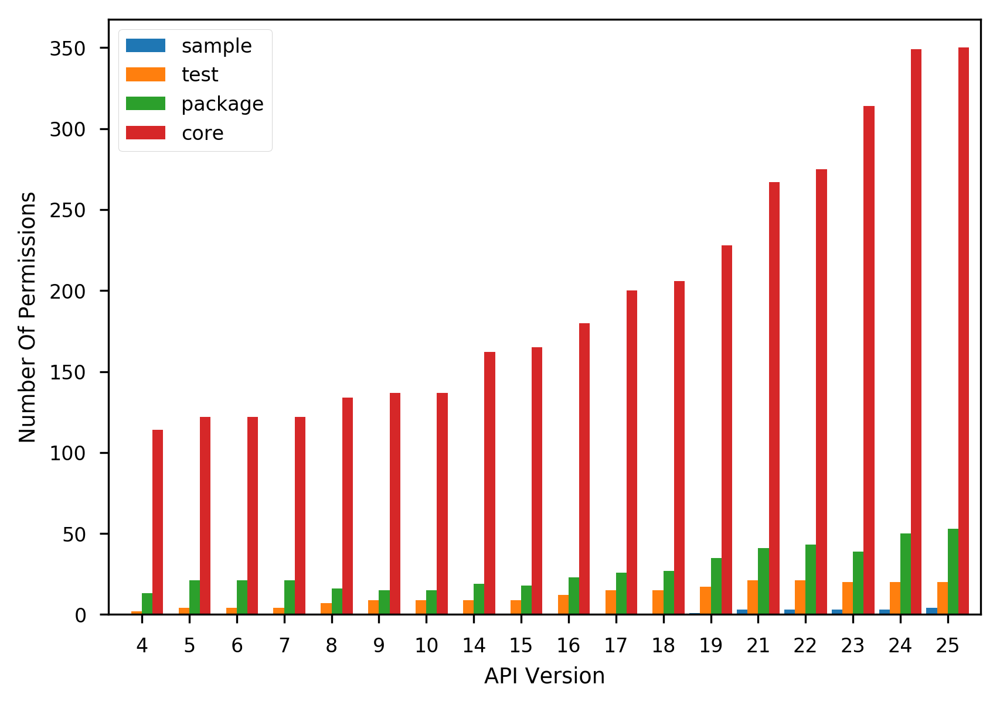
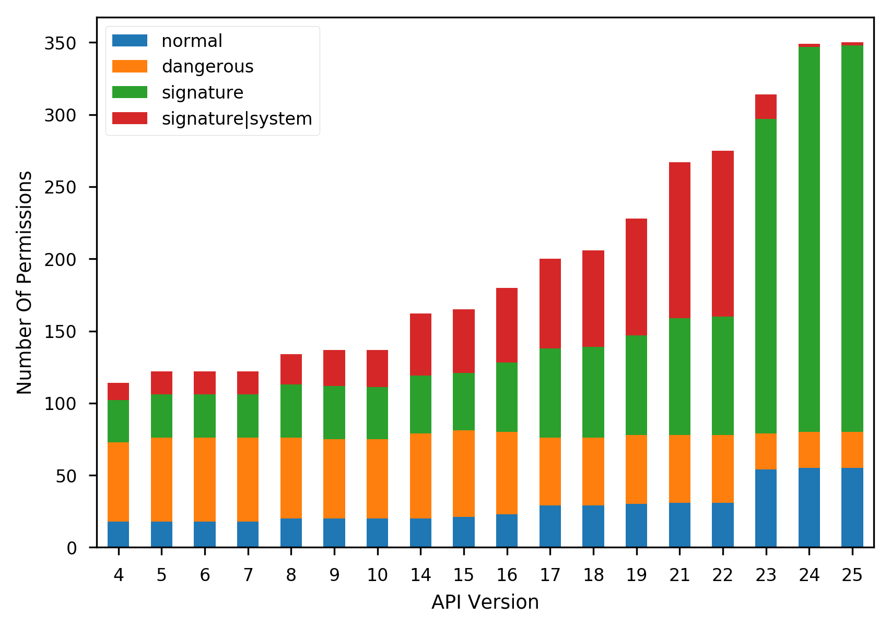
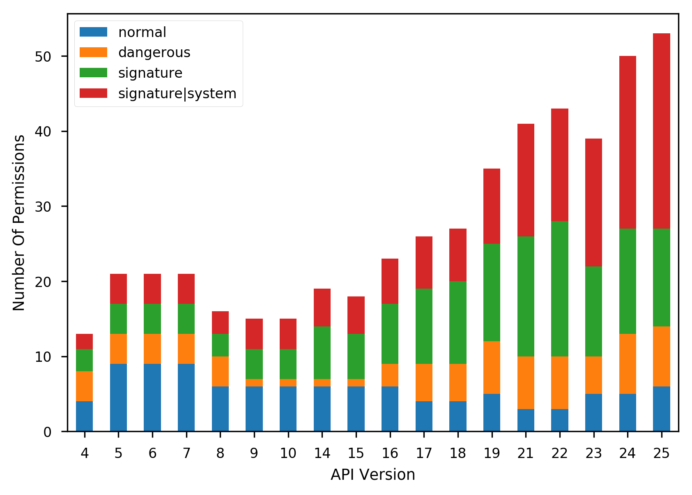

# Android Permission Evolution
Analysis of the evolution of Android permissions. This repository contains the
results presented in the paper "Small Changes, Big Changes: An Updated View on
the Android Permission System".


## Description
Since the appearance of Android, its permission system was central to many
studies of Android security. For a long time, the previous description of the
architecture provided by Enck et al. the seminal work "Understanding Android
Security" was immutably used in various research papers. The introduction of
highly anticipated runtime permissions in Android 6.0 forced us to reconsider
this model.

In this repository you will find the results of the analysis of the permission evolution in the Android Open Source Project (AOSP). We spit all the permissions into 4 groups:

* **sample** - permissions that are declared by the sample apps shipped with the
platform source code (appeared from API 21);
* **test** - permissions that are declared in the manifest files of packages developed for testing purposes;
* **package** - permissions that are declared in various packages that complement the framework, and that are not of **test** or **sample** groups;
* **core** -  permissions that are declared in the core Android manifest file located in the `frameworks/base/core/res` folder.

The following figure shows the amount of permissions in different Android API versions according to this classification:

<p align="center">
  
</p>

After that we analyzed these permissions in details. In particular, we extracted the information to which permission group they belong to, their protection level, protection level flags and permission flags. All the permissions with the corresponding information can be found in the `dataset/` directory. Additionally, there you can also find the information about the permission groups.  

<p align="center">
  
  
</p>

The directory `analysis/` contains the description of the changes related to permission and permission groups happened in the different API versions.  

The details qualitative analysis on how the changes influence on the security analysis as well as on application developers can be found in [our paper][1].


## Publication
The results of our research were presented at the 19th International Symposium on Research in Attacks, Intrusions and Defenses (RAID 2016). Please use the
following bibtex reference to cite our paper:

```
@inproceedings{SmallChangesBigChanges_Zhauniarovich2016,
    author = {Zhauniarovich, Yury and Gadyatskaya, Olga},
    title = {{Small Changes, Big Changes: An Updated View on the Android Permission System}},
    booktitle = {Proceedings of 19th International Symposium on Research in Attacks, Intrusions and Defenses},
    series = {RAID 2016},
    pages = {346--367},
    year = {2016},
    isbn={978-3-319-45719-2},
    doi={10.1007/978-3-319-45719-2_16},
    url={http://dx.doi.org/10.1007/978-3-319-45719-2_16}
}
```


## Additional resources
* [**Presentation Slides at RAID**][2]
* [**Presentation Slides at the University of Luxembourg**][3]


[1]:http://www.zhauniarovich.com/files/pubs/SmallChangesBigChanges_Zhauniarovich2016.pdf
[2]:http://www.zhauniarovich.com/files/talks/SmallChangesBigChanges_RAID2016.pdf
[3]:http://www.zhauniarovich.com/files/talks/SmallChangesBigChanges_Luxembourg2017.pdf
